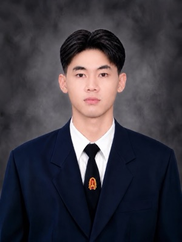

# 🐧 TYPC D — INT100 Group 2, Team 07

INT100 Design Thinking 1/2026 · School of Information Technology, KMUTT

---

## 🏷️ ที่มาของชื่อทีม

> (คุยกันใน Issue "ที่มาของชื่อทีม" ก่อน แล้วสรุปมาเขียนตรงนี้)

ชื่อทีม **TYPC D** มาจาก ...

- ใครเป็นคนเสนอ:
- ความหมายเบื้องหลังชื่อ:
- ทำไมทีมถึงเลือกชื่อนี้:

_(ข้อนี้อาจารย์บังคับ: "Describe how you came up with your team name. Is there a meaning behind the name?")_

---

## 👥 สมาชิกทีม

| ชื่อ | GitHub | เขียนแนะนำโดย |
| --- | --- | --- |
| (ชื่อ-นามสกุล) | [@Tayakorn000](https://github.com/Tayakorn000) | |
| ศญาฎา สุดยินดี | [@sayada06](https://github.com/sayada06) | [@nonnyhiw](https://github.com/nonnyhiw) |
| (ชื่อ-นามสกุล) | [@QuoalaZ](https://github.com/QuoalaZ) | |
| แดนนี่ อินทรังสี | [@nonnyhiw](https://github.com/nonnyhiw) | [@greenbank-336](https://github.com/greenbank-336) |
| (ชื่อ-นามสกุล) | [@pickerkung](https://github.com/pickerkung) | |
| ธีระเดช พลดอน | [@greenbank-336](https://github.com/greenbank-336) | [@sayada06](https://github.com/sayada06) |

---

## ✍️ วิธีเขียนหัวข้อของตัวเอง

คัดลอกบล็อกด้านล่างไปแก้ ห้ามลืม 4 อย่างที่อาจารย์บังคับ:
รูป (อัปโหลดขึ้น GitHub ใช้ relative link) · ลิงก์ออกนอก GitHub · list · emoji

---

## 🙋 แบงค์

- 🏫 **ชื่อเล่น:** แบงค์
- 💻 **GitHub:** [@greenbank-336](https://github.com/greenbank-336)
- 🔗 **ลิงก์:** [@chedareet](https://instagram.com/chedareet/)
- 🎯 **สิ่งที่ชอบทำ:** ส่วนใหญ่จะเป็นการเล่นเกม ฟังเพลง แต่ก็มีวาดภาพและอ่านหนังสือบ้างบางครั้ง

### **เรื่องที่ได้จากการสัมภาษณ์**

แบงค์จบมาจาก ***โรงเรียนมัธยมวัดสิงห์***  
***ทำไมแบงค์ถึงอยากเรียนที่นี่*** อย่างแรกเลยแบงค์บอกว่าที่นี่เป็นมหาลัยที่มีชื่อเสียง อย่างที่สองคือมหาวิทยาลัยอยู่ใกล้กับบ้าน และที่เลือกเรียนคณะนี้เพราะ แบงค์ชอบโน๊ตบุ๊คและคอม เป็นพิเศษ อีกทั้งยังมีความชอบในด้าน AI และแบงค์สงสัยว่า AI ทำยังไงถึงเกิดขึ้น อะไรทำให้หลายคนมองว่า AI น่ากลัว และอยากรู้ว่า AI ในโลกของเราจะสามารถพัฒนาถึงในระดับที่เขาบอกว่า  เหนือกว่ามนุษย์ทุกคนในทุกด้านอย่าง ASI(Artificial Super intelligent) ได้ไหม  
***สิ่งที่แบงค์ประทับใจ*** เป็นในเรื่องที่คอยช่วนสอนเพื่อนในเรื่องที่เพื่อนคนนั้นไม่เข้าใจแต่ตัวเองนั้นเข้าใจ

> คำพูดที่แบงค์ชอบที่สุดคือ **"what the"(ลากยาว) และคำว่า "จะว่าไป"**

**✏️ เขียนแนะนำโดย:**

**[@sayada06](https://github.com/sayada06)** | นางสาวศญาฎา สุดยินดี (โฟม) รหัสนักศึกษา 69130500098 

---

## 🙋 โฟม

- 🏫 **ชื่อเล่น:** โฟม
- 💻 **GitHub:** [@sayada06](https://github.com/sayada06)
- 🔗 **ลิงก์:** [sixthofjune._](https://www.instagram.com/sixthofjune._/)
- 🎯 **สิ่งที่ชอบทำ:** เล่นเกม ดูซีรี่ย์

**เรื่องที่ได้จากการสัมภาษณ์**    
โฟมจบจาก ***วิทยาลัยเทคโนโลยีพงษ์สวัสดิ์***    
***ทำไมถึงอยากเรียนที่นี่*** โฟมอยากเรียนที่นี่เพราะที่นี่โด่งดังในด้านไอทีและแผนการเรียนตรงตามความต้องการ อีกทั้งสภาพแวดล้อมดูดีและที่เลือกสาขา IT เพราะส่วนตัวชอบเล่นเกมและอยู่กับคอมพิวเตอร์เป็นเวลานา ทำให้อยากเรียนและทำงานเกี่ยวกับคอมพิวเตอร์ และยิ่งพอได้เริ่มเขียนโค้ดในด้านเว็บ ทำให้รู้สึกว่าชอบและสนใจที่จะเรียนรู้เพิ่มเติมในด้านนี้จริงๆ   
***สิ่งที่โฟมประทับใจคือ*** การที่มุ่งมั่นตั้งใจทำตามความฝันของตัวเองและมีความฝันชัดเจน ถึงแม้ว่าจะหาเจอช้า แต่ตอนนี้ก็สำเร็จไปหนึ่งขั้นแล้วคือการได้ติดมหาลัยในฝัน

> คำพูดที่โฟมชอบที่สุดคือ **"จริงป้ะ"** **"กินไรดี"** 
**"กลับห้องและ"**

**✏️ เขียนแนะนำโดย:**

**[@nonnyhiw](https://github.com/nonnyhiw)** | นายแดนนี่ อินทรังสี (แดนนี่) รหัสนักศึกษา 69130500106   

---

## 🙋 แดนนี่

- 🏫 **ชื่อเล่น:** แดนนี่
- 💻 **GitHub:** [@nonnyhiw](https://github.com/nonnyhiw)
- 🔗 **ลิงก์:** [dd_dannyyy]( https://www.instagram.com/dd_dannyyy?igsh=MXJmMHU5cDV5OTF6)
- 🎯 **สิ่งที่ชอบทำ:** เล่นกีฬา , ร้องเพลง

**เรื่องที่ได้จากการสัมภาษณ์**

แดนนี่จบมาจาก **โรงเรียนสิริรัตนาธร**  
**ทำไมถึงเข้าเรียนที่นี่** เพราะเป็นมหาลัยที่มีชื่อเสียงและเด่นในด้านไอที มีหลักสูตรการเรียนหลากหลายและทันสมัย และด้วยความที่ตัวเองมีความสนใจและชื่นชอบในด้านไอที และที่บางมดก็เป็นมหาลัยที่มีชื่อเสียงโด่งดังและเด่นในด้านไอทีและรวมทั้งคณะเทคโนโลยีสารสนเทศเป็นคณะที่มีหลักสูตรการเรียนที่มีความหลากหลายและทันสมัย 
**สิ่งที่เพื่อนประทับใจ:** ทำงานเสร็จก่อน deadline

> **ยื่นฟ้องศาลเรื่องเขาไม่รักผมสรุปศาลไม่ตัดสินศาลบอกให้ตัดใจ**

**✏️ เขียนแนะนำโดย:**

**[@greenbank-336](https://github.com/greenbank-336)** | นายธีระเดช พลดอน (แบงค์) รหัสนักศึกษา 69130500107

---

## 🙋 ชื่อเพื่อนคนที่ 4

- 🏫 **ชื่อเล่น:**
- 💻 **GitHub:** [@username](https://github.com/username)
- 🔗 **ลิงก์:** [Instagram](https://instagram.com/xxxx)
- 🎯 **สิ่งที่ชอบทำ:**

**เรื่องที่ได้จากการสัมภาษณ์**

> quote

**✏️ เขียนแนะนำโดย:**

---

## 🙋 ชื่อเพื่อนคนที่ 5

- 🏫 **ชื่อเล่น:**
- 💻 **GitHub:** [@username](https://github.com/username)
- 🔗 **ลิงก์:** [Instagram](https://instagram.com/xxxx)
- 🎯 **สิ่งที่ชอบทำ:**

**เรื่องที่ได้จากการสัมภาษณ์**

> quote

**✏️ เขียนแนะนำโดย:**

---

## 🙋 ชื่อเพื่อนคนที่ 6

- 🏫 **ชื่อเล่น:**
- 💻 **GitHub:** [@username](https://github.com/username)
- 🔗 **ลิงก์:** [Instagram](https://instagram.com/xxxx)
- 🎯 **สิ่งที่ชอบทำ:**

**เรื่องที่ได้จากการสัมภาษณ์**

> quote

**✏️ เขียนแนะนำโดย:**

---

## 🔄 วิธีทำงานกับไฟล์นี้ (GitHub Flow)

1. สร้าง branch ของตัวเอง เช่น `intro-sayada06`
2. แก้เฉพาะหัวข้อของตัวเอง แล้ว commit หลายครั้ง
3. เปิด Pull request มาที่ `main`
4. **เพื่อนในทีมต้องกด Review แล้ว Approve ก่อนถึงจะ merge ได้** (อาจารย์บังคับ)
5. merge เข้า `main`
